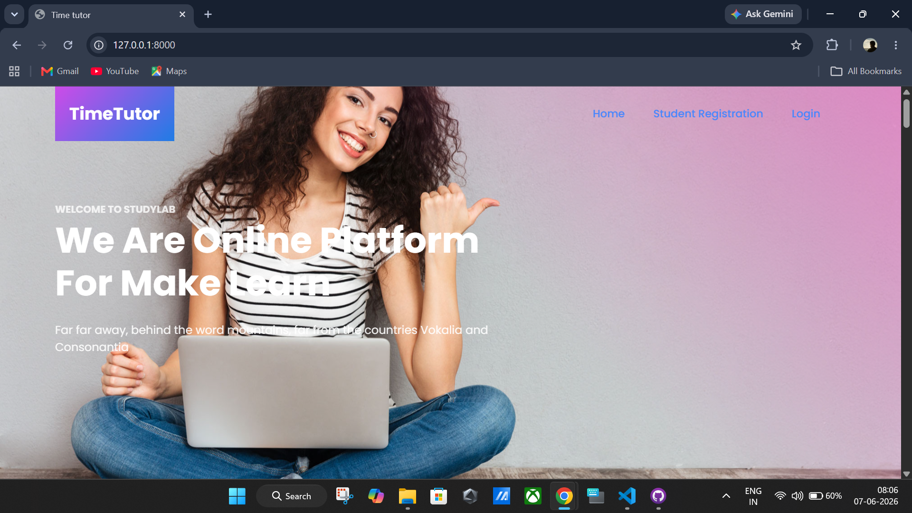
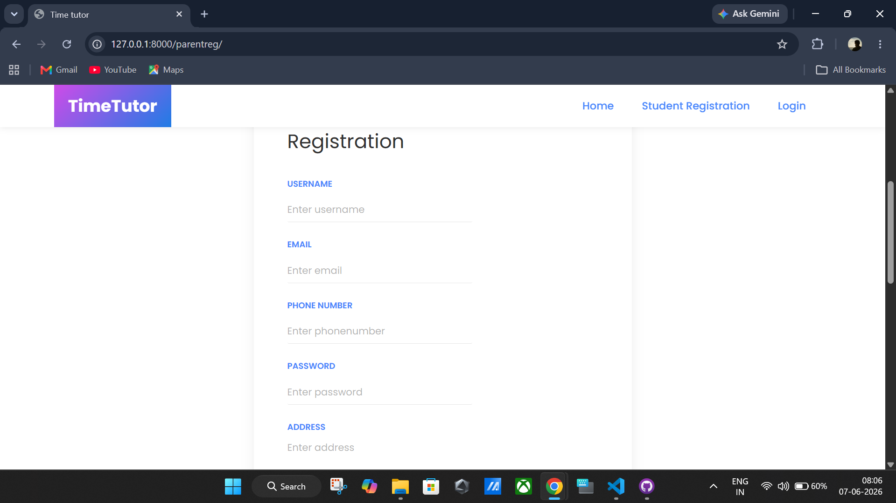
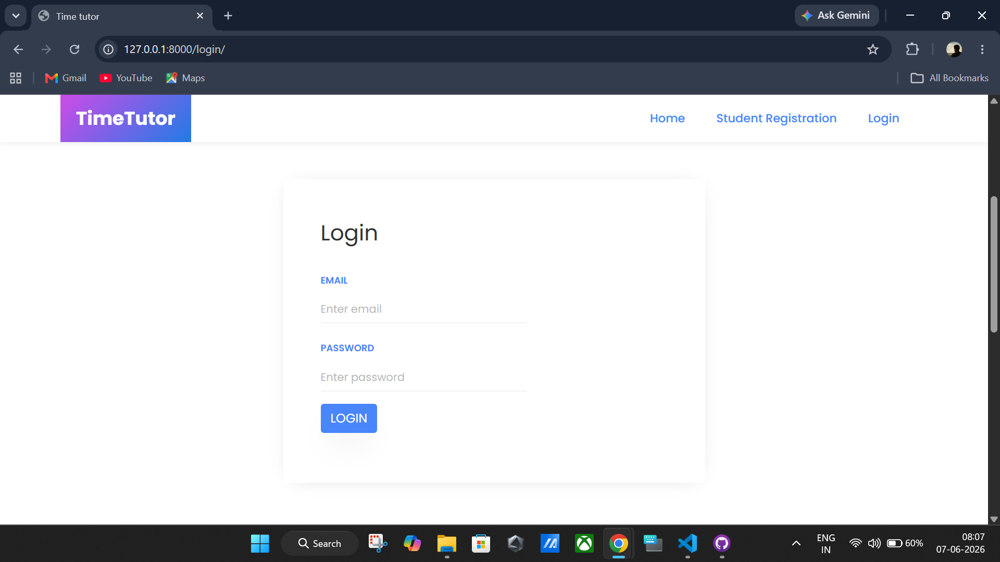
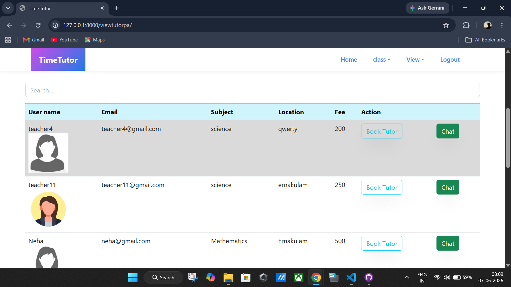
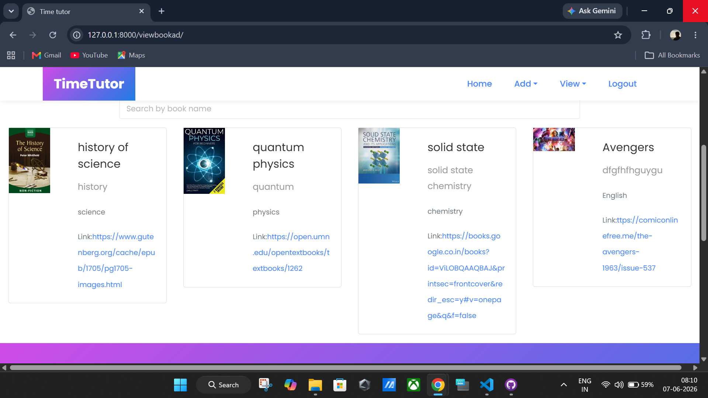
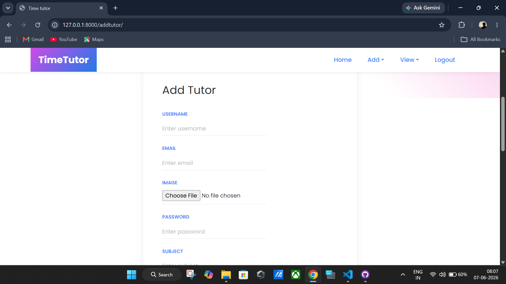

# Online Private Tutor

A web-based Online Private Tutor platform developed using Django and SQLite. The system helps students find tutors, register accounts, access study materials, and interact with educational resources through a simple and user-friendly interface.

## Features

- Student Registration and Login
- Parent Registration and Login
- Tutor Management
- Book Management
- View Available Tutors
- Study Material Access
- Admin Approval System
- SQLite Database Integration
- Responsive User Interface

## Technologies Used

- Python
- Django
- SQLite3
- HTML
- CSS
- JavaScript
- Bootstrap

## Installation

1. Clone the repository

```bash
git clone https://github.com/sheikismailajmal/OnlinePrivateTutor.git
```

2. Navigate to the project folder

```bash
cd OnlinePrivateTutor
```

3. Install dependencies

```bash
pip install django
```

4. Run migrations

```bash
python manage.py migrate
```

5. Start the development server

```bash
python manage.py runserver
```

6. Open your browser and visit

```text
http://127.0.0.1:8000/
```

## Project Structure

```text
OnlinePrivateTutor/
│
├── app/
├── project/
├── static/
├── templates/
├── screenshots/
├── manage.py
└── README.md
```

## Screenshots

### Home Page



### Student Registration



### Login Page



### Tutors Page



### Books Page



### Add Tutor Page



## Future Enhancements

- Online Payment Integration
- Tutor Rating System
- Live Chat Feature
- Video Session Integration
- Email Notifications

## Author

Sheik Ismail Ajmal

MCA (Cyber Security)

Jain University

## License

This project is developed for educational and learning purposes.